<properties 
   pageTitle="Microsoft Azure AD Connect - Upgrade from Windows Azure AD sync tool (DirSync)" 
   description="Learn how to upgrade from DirSync to Azure AD Connect.  This articles describes the steps for upgrading your current Windows Azure AD sync tool (DirSync) to Azure AD Connect." 
   services="active-directory" 
   documentationCenter="" 
   authors="shoatman" 
   manager="terrylanfear" 
   editor="billmath"/>

<tags 
   ms.service="active-directory" 
   ms.workload="identity" 
   ms.tgt_pltfrm="na" 
   ms.devlang="na" 
   ms.topic="article" 
   ms.date="05/26/2015" 
   ms.author="shoatman"/>

# Upgrading Windows Azure Active Directory sync (DirSync) to Azure Active Directory Connect

The following documentation will help you upgrade your existing DirSync installation to Azure AD Connect

## Download Azure AD Connect

To get started using Azure AD Connect you can download the latest version using the following: [Download Azure AD Connect](http://go.microsoft.com/fwlink/?LinkId=615771) 

## Before you install Azure AD Connect
Before you install Azure AD Connect, and upgrade from DirSync here are a few things you will need.  

- The password of the existing global administrator account for your Azure AD instance (The install will remind you which account this is)
- An Enterprise Administrator account for your local Active Directory
- Optional: If you configured DirSync to use a full version of SQL Server - The information for that database instance.

### Parallel deployment

If you are currently synchronizing more than 50K objects then you will be given an option to perform a parallel deployment.  Parallel deployment requires a separate server or set of servers (if you require a separate server for SQL Server).  The benefit of parallel deployment is the opportunity to avoid synchronization downtime.  The Azure AD Connect installation will attempt to estimate the downtime that we expect, but if you've upgraded DirSync in the past your own experience is likely to be the best guide.

## Installing Azure AD Connect

Download Azure AD Connect and copy to your existing DirSync server.  

1. Navigate to and double-click on AzureADConnect.msi
2. Begin stepping through the wizard

For in-place upgrade the following high level steps occur:

1. Welcome to Azure AD Connect
2. Analysis of current DirSync Configuration
3. Collect Azure AD global admin password
4. Collect credentials for an enterprise admin account (only used during the installation of Azure AD Connect)
5. Installation of AAD Connect
    * Unintall DirSync
	* Install AAD Connect
	* Optionally begin Synchronization

Additional steps/information is required when:

* You're currently using Full SQL Server - Local or Remote
* You have more than 50K objects in scope for synchronization

## In-place upgrade - less than 50K objects - SQL Express (Walkthrough)

0. Launch the Azure AD Connect Installer (MSI)

1. Review and agree to license terms and privacy notice.

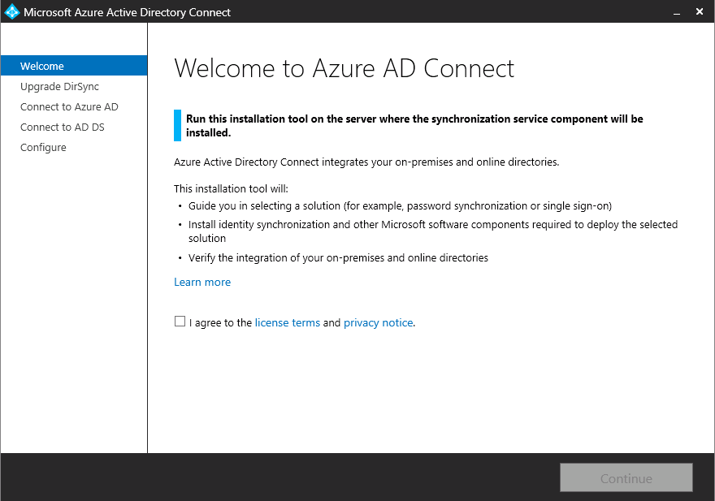

2. Click next to be analysis of your existing DirSync installation

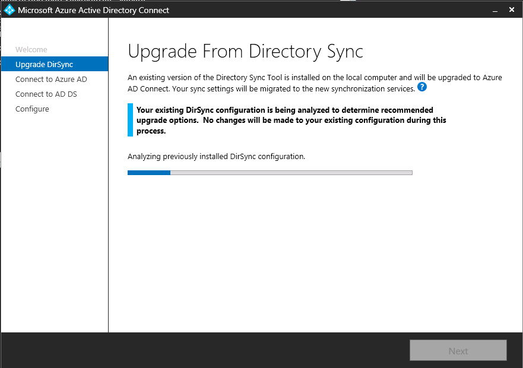

3. When the analysis completes we will make recommendations on how to proceed.  In this scenario (less than 50K objects using SQL Express) the following screen is displayed.

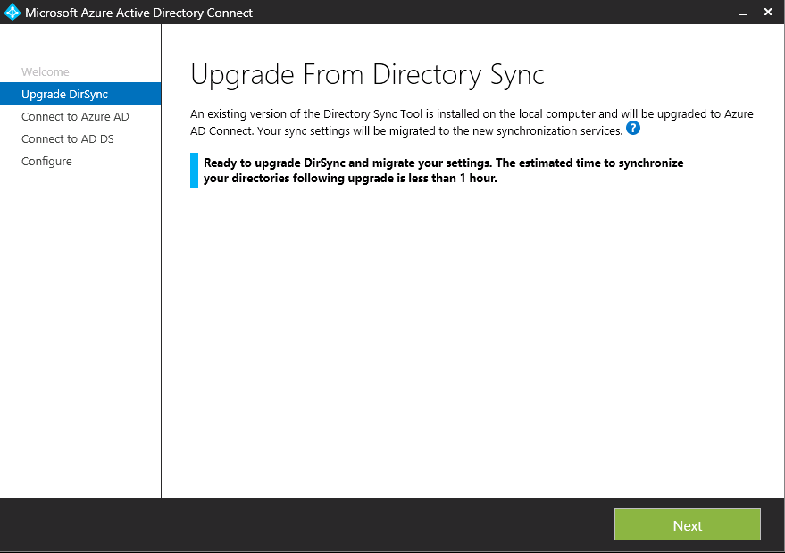

4. Provide the password for the account you currently use to connect to Azure AD.

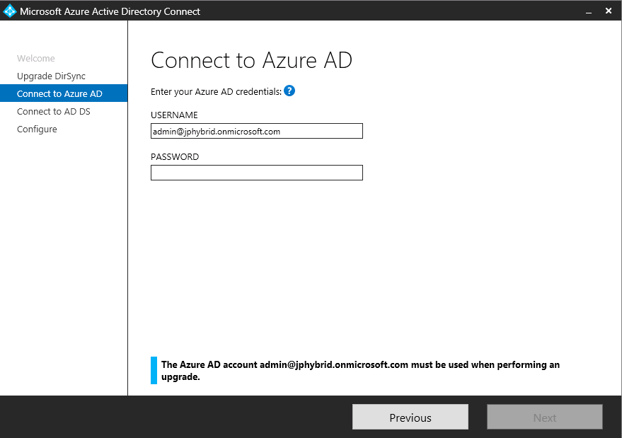

5. Provide an enterprise admin account for Active Directory.

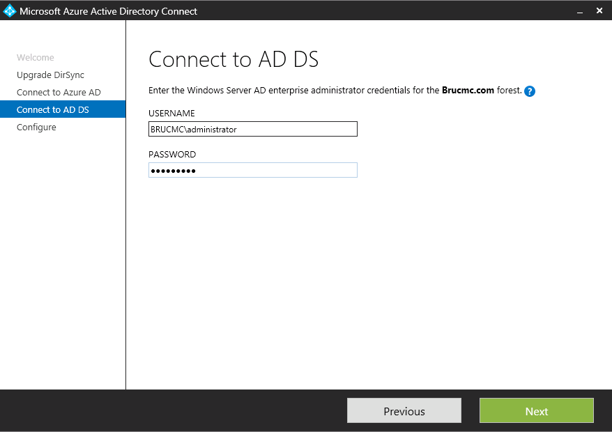

6. You're now ready to configure.  When you clieck next DirSync will be uninstalled and Azure AD Connect will be configured and begin synchronizing.  

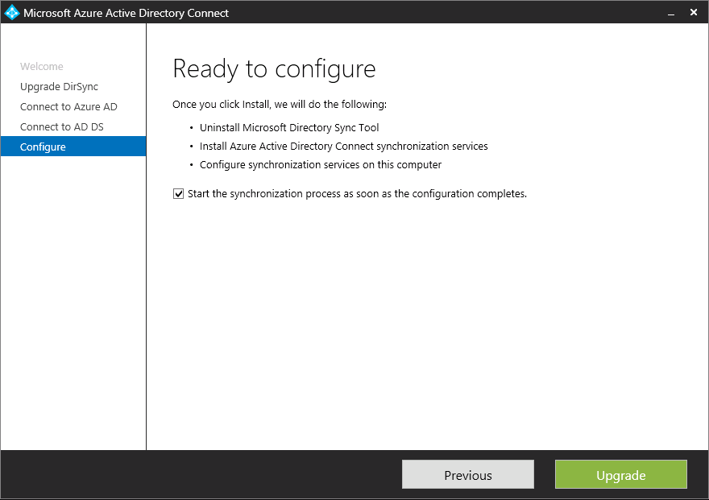

## In-place upgrade - more than 50K objects
At step #3 you will see a different message if you have more than 50K objects in scope for synchronization.  A screen similar to the following will be displayed:

In this case we recommend you consider a parallel upgrade on a separate server.  Our reason for this recommendation is that depending on the size of your organization an in-place upgrade may impact your service level agreements with your business regarding how quickly changes in local Active Directory are reflected in Azure AD / Office 365.  We attempt to estimate how long it may take for the first synchronization using Azure AD Connect.  As mentioned above, your own experience with the original installation of DirSync or upgrades to DirSync are likely to be the best indicator.  

Parallel deployment requires a separate server or servers (if you are required to run SQL Server on a separate server from Azure AD Connect).  For that reason it's completely reasonable to consider an in-place upgrade if it can be scheduled in way to avoid impacts within your organization.  

To proceed with an in-place upgrade click the checkbox next to the message: "Continue upgrading DirSync on this computer".

## In-place upgrade - Full SQL Server

At step #3 you will see a different message if your DirSync installation is using a local or remote full version of SQL Server.  A screen similar to the following will be displayed:

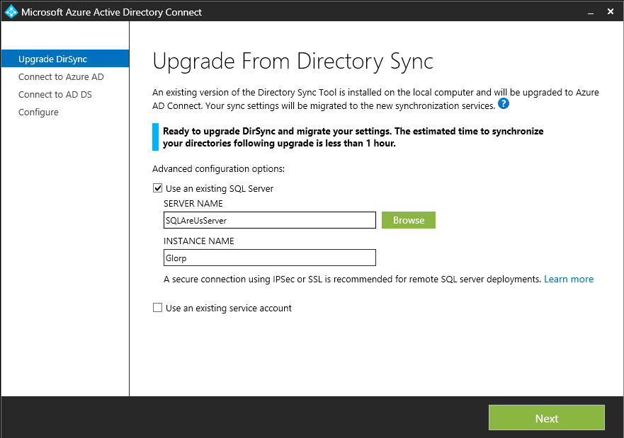

The information regarding the existing SQL Server database server being used by DirSync is displayed to you.  If need be make the appropriate adjustments.  Clicking "Next" will continue the installation.

## Parallel deployment - more than 50K objects

At step #3 if you have more than 50K objects the Azure AD Connect installation will recommend a parallel deployment.  See "In-place upgrade - more than 50K objects" above for information on whether to choose in-place or pallell deployment of Azure AD Connect.   A screen similar to the following will be displayed:

If you want to proceed with parallel deployment you will need to perform the following steps:

- Click the "Export settings" button.  When you install Azure AD Connect on a separate server these settings will be imported to migrate any settings from your Current DirSync to your new AAD Connect installation.

Once your settings have beens successfully exported you can exit the Azure AD Connect wizard on the DirSync server.

### Installation of Azure AD Connect on separate server

When you install Azure AD Connect on a new server it won't find DirSync and will assume that you want to perform a clean install of Azure AD Connect.  There are a couple of special steps here:

1. Run the Azure AD Connect installer (MSI)
2. When you see the "Welecome to Azure AD Connect" screen.  Exit the wizard by clicking the "X" in the top right corner of the windows.
3. Open a command prompt
4. From the install location of Azure AD Connect (Default: C:\Program Files\Microsoft Azure Active Directory Connect) execute the following command:
    * AzureADConnect.exe /migrate

Azure AD Connects and presents you with the following UI:

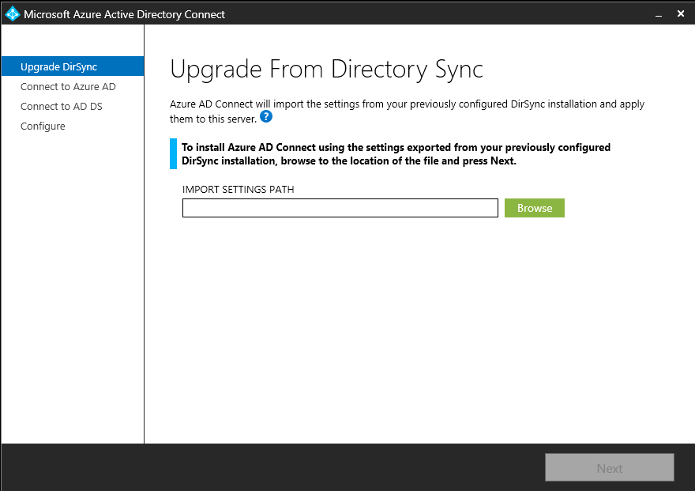

5. Select the settings file that exported from your DirSync installation.
6. Configure any advanced options including:
    * A custom installation location for Azure AD Connect
	* An existing instance of SQL Server (Default: Azure AD Connect installs SQL Server 2012 Express)
	* A service account used to connect to SQL Server (If your SQL Server database is remote then this account must be a domain service account)

See those options in the following UI:

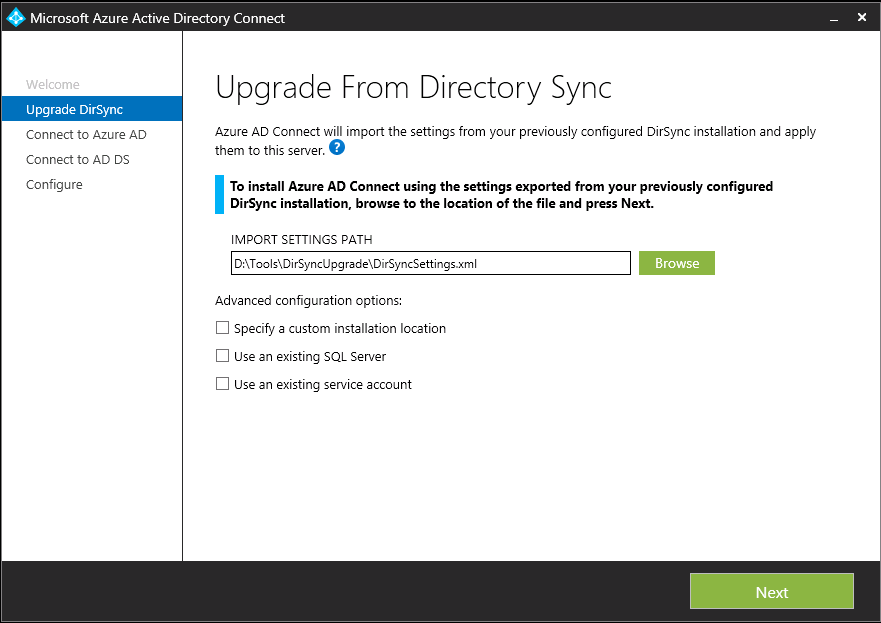

7. Click Next. 
8. On the "Ready to configure" page leave the "Start the synchronization process as soon as the configuration completes" checked.
[AZURE.NOTE] Synchronization between Windows Server Active Directory and Azure Active Directory will begin, but no changes will be exported to Azure AD.  Only one synchronization tool can be actively exporting changes at a time.
9. Click "Install".

[AZURE.NOTE] We uncheck the start synchronization checkbox in order to ensure that DirSync, which is still installed and running and Azure AD Connect do not attempt to write to AAD at the same time.    

### Check that Azure AD Connect is ready to begin sychronization

In order to determine whether or not Azure AD Connect is ready to takeover from DirSync you'll need to open the Azure AD Connect Synchronization Service Manager.  Searching using "Synchronization" at the Start menu of Windows will reveal this application.

Within the application you will will need to view the "Operations" tab.  On this tab you are looking to confirm that the following operations have been completed:

- Import on the AD Management Agent
- Import on the Azure AD Management Agent
- Full Sync on the AD Management Agent
- Full Sync on the Azure AD Management Agent

Once these 4 operations have been completed you're ready to uninstall DirSync and enable Azure AD Connect Synchronization.

### Uninstall DirSync (old Server)

- From within "Add or remove programs" locate "Windows Azure Active Directory sync tool"
- Uninstall "Windows Azure Active Directory sync tool"

### Open Azure AD Connect (new Server)
After installation re-opening Azure AD connect will provide you with a configuration experience.  Open Azure AD Connect.

You should see the following:

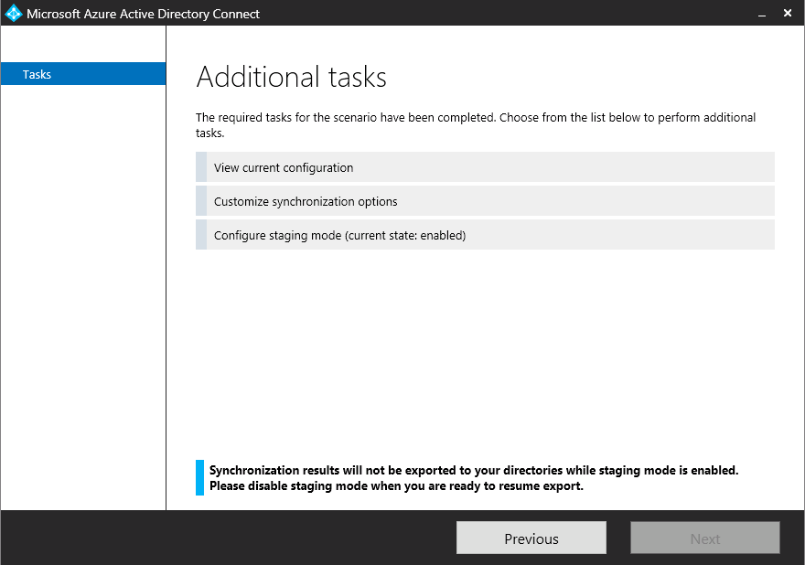

* Select "Configure staging mode"
    * Upgrading from DirSync using exported settings automatically puts Azure AD Connect in staging mode.  Staging mode basically means that Synchronization will occur within Azure AD connect, but changes will not be exported to Azure AD or AD.
* Turn off staging by unchecking the "Enabled staging mode" checkbox.

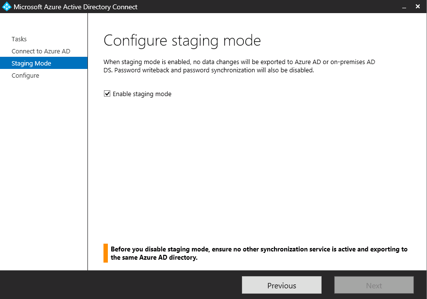

* Click the install button

Congratulations you've successfully migrated to Azure AD Connect using Parallel deployment.

## Azure AD Connect supporting components

The following is a list of per-requisites and supporting components that Azure AD Connect will install on the server that you set Azure AD Connect up on.  This list is for a basic Express installation.  If you choose to use a different SQL Server on the Install synchronization services page then, the SQL Server 2012 components listed below are not installed. 

- Forefront Identity Manager Azure Active Directory Connector
- Microsoft SQL Server 2012 Command Line Utilities
- Microsoft SQL Server 2012 Native Client
- Microsoft SQL Server 2012 Express LocalDB
- Azure Active Directory Module for Windows PowerShell
- Microsoft Online Services Sign-In Assistant for IT Professionals
- Microsoft Visual C++ 2013 Redistribution Package

**Additional Resources**

* [Use your on-premises identity infrastructure in the cloud](active-directory-aadconnect.md)
* [How Azure AD Connect works](active-directory-aadconnect-how-it-works.md)
* [Whats Next with Azure AD Connect](active-directory-aadconnect-whats-next.md)
* [Learn More](active-directory-aadconnect-learn-more.md)
* [Azure AD Connect on MSDN](https://msdn.microsoft.com/library/azure/dn832695.aspx)
 